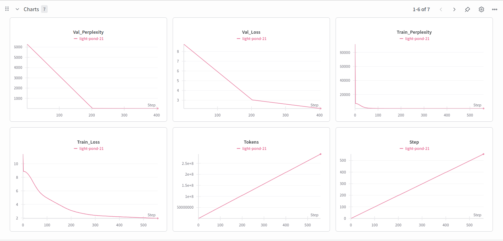

# SmolUrixtral - Mixtral Inspired Model

A PyTorch implementation of a Mixtral inspired transformer model with Mixture of Experts (MoE), designed for text generation and understanding tasks. This model is built on the Mixtral architecture with enhancements like Flash Attention, SWiGLU activation, and Liger kernels for optimized performance.

- So, I trained a MoE based a 53M architecture.
- Trained on Urdu-1M-news-text dataset from HuggingFace consisting of 1M texts for a total of 800 steps
## Examples

Provided under the `generated_data/` directory, these examples showcase the model's capabilities in text generation and understanding.

## Model Weights
**💾 Download Pre-trained Weights**: 
- **Hugging Face Model**: [mahwizzzz/SmolUrixtral](https://huggingface.co/mahwizzzz/SmolUrixtral)

## Features

- **Flash Attention**: Efficient attention mechanism with memory optimization
- **Mixture of Experts (MoE)**: 8 experts with top-2 routing and noisy top-k support
- **SWiGLU Activation**: Advanced activation function in expert layers
- **Rotary Positional Embeddings**: Position encoding for sequence understanding
- **Liger Kernels**: Optimized kernels for faster training (optional)
- **Distributed Training**: Support for multi-GPU training with DDP
- **Advanced Optimizer**: AdamW optimizer with custom learning rate scheduling
- **Gradio Interface**: Interactive web interface for text generation

## Model Architecture

### Default Configuration
- **Embedding Dimensions**: 384
- **Decoder Layers**: 4
- **Attention Heads**: 4
- **MoE Experts**: 8 (top-2 routing)
- **Block Size**: 512 tokens
- **Vocabulary Size**: Based on Llama-2-7b tokenizer (~32,000 tokens)
- **Batch Size (micro)**: 2
- **Gradient Accumulation Steps**: 4

### Full Parameter List

#### Model Architecture Parameters
- `epochs`: Number of training epochs (default: 4)
- `block_size`: Maximum sequence length (default: 1024)
- `batch_size`: Training batch size (default: 16)
- `embeddings_dims`: Model embedding dimensions (default: 512)
- `no_of_heads`: Number of attention heads (default: 8)
- `no_of_decoder_layers`: Number of decoder layers (default: 12)
- `attn_dropout`: Attention dropout rate (default: 0.1)
- `dropout`: General dropout rate (default: 0.1)

#### Mixture of Experts (MoE) Parameters
- `experts`: Number of MoE experts (default: 8)
- `top_experts`: Number of experts to route to (default: 2)
- `noisy_topk`: Use noisy top-k routing (default: False)

#### Training Hyperparameters
- `max_lr`: Maximum learning rate (default: 6e-4)
- `weight_decay_optim`: Weight decay for optimizer (default: 0.01)
- `beta_1`: Beta1 for optimizer (default: 0.9)
- `beta_2`: Beta2 for optimizer (default: 0.95)
- `eps`: Epsilon for optimizer (default: 1e-8)
- `clip`: Gradient clipping value (default: 1.0)

#### System Configuration
- `device`: Device to use (default: 'cuda:0')
- `use_checkpointing`: Use gradient checkpointing (default: False)
- `use_liger`: Use Liger kernels for optimization (default: True)
- `use_flash_attention`: Use Flash Attention (default: True)
- `use_compile`: Use torch.compile (default: True)

#### Data Configuration
- `vocab_size`: Vocabulary size (default: based on tokenizer + 768)
- `val_epochs`: Validation frequency (default: 2)

